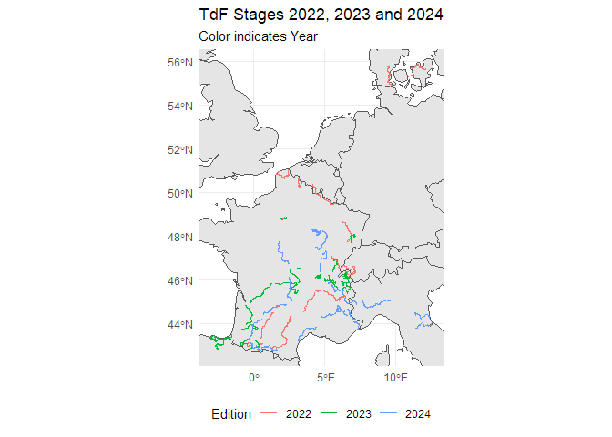

# Idea

Plot the routes of the last Tour de France editions onto a single map.

# Reproducibility

If you want to reproduce this post, you have to perform the following
steps:

-   Clone the repository
-   Run `renv::restore()`
-   Run `targets::tar_make()`

# Data

In this post the following libraries are used:

    library(rnaturalearthdata)
    library(rnaturalearth)
    library(tarchetypes)
    library(conflicted)
    library(reactable)
    library(tidyverse)
    library(leaflet)
    library(targets)
    library(assertr)
    library(janitor)
    library(polite)
    library(rvest)
    library(fs)
    library(sf)

    conflicts_prefer(dplyr::filter)
    conflicts_prefer(dplyr::lag)

Website (Lustig, Eppinga, and Fox (2018)) where the data is available
from:

    base_url <- "https://www.cyclingstage.com/"

Define paths to editions:

    editions <- c("tour-de-france-2022-gpx", "tour-de-france-2023-gpx", 
         "tour-de-france-2024-gpx", "tour-de-france-2025-route")

In the following section, get all links to so called ‘.gpx’ files. These
file represent the geographic data of the routes from the different
editions. To do this perform the following steps:

-   Introduce ourselves to the host to identify the rules defined in the
    ‘robots.txt’ file (Perepolkin (2023))
-   Scrape all html files resulting from the above mentioned editions.
    By using functions from the ‘polite’ package we automatically obey
    the rules defined from the host
-   Search for all html elements that represent links (Wickham (2024))
-   Further filter those links for elements with the text ‘GPX’ in them
    (excluding links that don’t represent ‘.gpx’ files) and extract the
    ‘href’ attribute
-   Put them into a final data frame and extract the year of the edition
    from the url (Wickham et al. (2019))

<!-- -->

    gpx_paths <- function(base_url, editions, links_css) {
      host <- bow(base_url)
      
      sessions <- map(editions, \(x) nod(host, x))
      
      overview <- map(
        sessions,
        \(x) scrape(x, content = "text/html; charset=iso-8859-1", verbose = TRUE))
      
      link_nodes <- map(overview, \(x) html_elements(x, links_css))
      
      gpx_paths <- map(
        link_nodes, \(x) html_attr(x[html_text2(x) == "GPX"], "href"))
      
      tibble(url = map_chr(sessions, "url")) |>
        mutate(
          gpx_path = gpx_paths, edition = str_extract(url, "\\d+"),
          .keep = "none") |>
        unnest(gpx_path)
    }

Define the CSS expression to identify relevant links. This expression
was determined using the developer tools of the browser:

    links_css <- ".data a"

Execute the above described function and make sure that every resulting
path is unique (Fischetti (2023)):

    df_gpx_paths <- verify(gpx_paths(base_url, editions, links_css), is_uniq(gpx_path))

    ## # A tibble: 66 × 2
    ##    gpx_path                                                              edition
    ##    <chr>                                                                 <chr>  
    ##  1 https://cdn.cyclingstage.com/images/tour-de-france/2022/stage-1-parc… 2022   
    ##  2 https://cdn.cyclingstage.com/images/tour-de-france/2022/stage-2-parc… 2022   
    ##  3 https://cdn.cyclingstage.com/images/tour-de-france/2022/stage-3-parc… 2022   
    ##  4 https://cdn.cyclingstage.com/images/tour-de-france/2022/stage-4-parc… 2022   
    ##  5 https://cdn.cyclingstage.com/images/tour-de-france/2022/stage-5-parc… 2022   
    ##  6 https://cdn.cyclingstage.com/images/tour-de-france/2022/stage-6-parc… 2022   
    ##  7 https://cdn.cyclingstage.com/images/tour-de-france/2022/stage-7-parc… 2022   
    ##  8 https://cdn.cyclingstage.com/images/tour-de-france/2022/stage-8-parc… 2022   
    ##  9 https://cdn.cyclingstage.com/images/tour-de-france/2022/stage-9-gpxr… 2022   
    ## 10 https://cdn.cyclingstage.com/images/tour-de-france/2022/stage-10-par… 2022   
    ## # ℹ 56 more rows

Now all the links to the relevant files are available.

The next step is to read in all the files and determine relevant
elements from these files. To to this perform the following steps:

-   As in the previous function use ‘polite’ functions to scrape all the
    files
-   Search for elements that represent so called ‘trackpoints’
-   Extract longitudinal information from these elements and put them in
    a data frame

<!-- -->

    track_points <- function(base_url, df_gpx_paths, track_point_css) {
      host <- bow(base_url)
      
      sessions <- map(pull(df_gpx_paths, gpx_path), \(x) nod(host, x))
      
      gpx_html <- map(
        sessions,
        \(x) scrape(x, content = "text/html; charset=iso-8859-1", verbose = TRUE))
      
      track_points <- map(gpx_html, \(x) html_elements(x, track_point_css))
      
      list_track_points <- map(
        track_points, \(x) tibble(
          lat = html_attr(x, "lat"),
          lon = html_attr(x, "lon"),
          elevation = html_text(x)))
      
      df_track_points <- df_gpx_paths |>
        mutate(df_track_points = list_track_points) |>
        unnest(df_track_points) |>
        mutate(across(c(lat, lon, elevation), \(x) parse_number(x)))
    }

Before we call the function define the CSS that will select the right
elements. Again this was determined using the SelectorGadget tool:

    track_point_css <- "trkpt"

Insert the base url, the links to the gpx files and the mentioned CSS
selector into the function and call it:

    df_track_points <- track_points(base_url, df_gpx_paths, track_point_css)

    ## # A tibble: 737,011 × 5
    ##    gpx_path                                        edition   lat   lon elevation
    ##    <chr>                                           <chr>   <dbl> <dbl>     <dbl>
    ##  1 https://cdn.cyclingstage.com/images/tour-de-fr… 2022     55.7  12.6         7
    ##  2 https://cdn.cyclingstage.com/images/tour-de-fr… 2022     55.7  12.6         7
    ##  3 https://cdn.cyclingstage.com/images/tour-de-fr… 2022     55.7  12.6         7
    ##  4 https://cdn.cyclingstage.com/images/tour-de-fr… 2022     55.7  12.6         7
    ##  5 https://cdn.cyclingstage.com/images/tour-de-fr… 2022     55.7  12.6         7
    ##  6 https://cdn.cyclingstage.com/images/tour-de-fr… 2022     55.7  12.6         7
    ##  7 https://cdn.cyclingstage.com/images/tour-de-fr… 2022     55.7  12.6         7
    ##  8 https://cdn.cyclingstage.com/images/tour-de-fr… 2022     55.7  12.6         7
    ##  9 https://cdn.cyclingstage.com/images/tour-de-fr… 2022     55.7  12.6         7
    ## 10 https://cdn.cyclingstage.com/images/tour-de-fr… 2022     55.7  12.6         7
    ## # ℹ 737,001 more rows

To ease the use of spatial data, turn the data frame into a ‘sf’
(Pebesma (2018)) object:

    stages_sf <- function(df_track_points) {
      sf_points <- df_track_points |>
        filter(!is.na(elevation)) |>
        st_as_sf(coords = c("lon", "lat"), crs = st_crs(4326))
      
      sf_multipoints <- sf_points |>
        group_by(gpx_path, edition) |>
        mutate(
          distance_delta = as.numeric(st_distance(
            geometry, lag(geometry), by_element = TRUE))) |>
        mutate(
          distance = cumsum(if_else(is.na(distance_delta), 0, distance_delta)),
          .keep = "unused") |>
        summarise(
          geometry = st_combine(geometry),
          elev_profile = list(tibble(distance = distance, elevation = elevation)),
          .groups = "drop")
      
      st_cast(sf_multipoints, "LINESTRING")
    }

If we apply the function, we get an data frame with one row per stage
and a geometry list column, that represents the spatial data of that
stage:

    sf_tdf_stages <- stages_sf(df_track_points)

    ## Simple feature collection with 66 features and 3 fields
    ## Geometry type: LINESTRING
    ## Dimension:     XY
    ## Bounding box:  xmin: -3.01601 ymin: 42.72618 xmax: 12.6 ymax: 55.85376
    ## Geodetic CRS:  WGS 84
    ## # A tibble: 66 × 4
    ##    gpx_path                       edition elev_profile                  geometry
    ##    <chr>                          <chr>   <list>                <LINESTRING [°]>
    ##  1 https://cdn.cyclingstage.com/… 2022    <tibble>     (12.56353 55.6796, 12.56…
    ##  2 https://cdn.cyclingstage.com/… 2022    <tibble>     (6.67252 46.21029, 6.672…
    ##  3 https://cdn.cyclingstage.com/… 2022    <tibble>     (6.34834 45.63295, 6.348…
    ##  4 https://cdn.cyclingstage.com/… 2022    <tibble>     (6.62028 44.91842, 6.620…
    ##  5 https://cdn.cyclingstage.com/… 2022    <tibble>     (6.00916 45.10007, 6.008…
    ##  6 https://cdn.cyclingstage.com/… 2022    <tibble>     (4.30587 45.43429, 4.305…
    ##  7 https://cdn.cyclingstage.com/… 2022    <tibble>     (2.55865 44.32343, 2.558…
    ##  8 https://cdn.cyclingstage.com/… 2022    <tibble>     (2.3313 43.18762, 2.3312…
    ##  9 https://cdn.cyclingstage.com/… 2022    <tibble>     (0.69061 43.09445, 0.690…
    ## 10 https://cdn.cyclingstage.com/… 2022    <tibble>     (-0.04125 43.07966, -0.0…
    ## # ℹ 56 more rows

Before we plot the data download the outlines of countries with the help
of the ‘rnaturalearth’ (Massicotte and South (2023)) package.

    world <- ne_countries(scale = "medium", returnclass = "sf")

Combine the stage data with the country outline data and plot the result
using ggplot techniques:

    vis_tdf_stages <- function(sf_tdf_stages, world) {
      tdf_bbox <- st_bbox(sf_tdf_stages)
      
      ggplot(data = world) +
        geom_sf() +
        geom_sf(data = sf_tdf_stages, mapping = aes(color = edition)) +
        coord_sf(
          xlim = c(tdf_bbox[["xmin"]], tdf_bbox[["xmax"]]),
          ylim = c(tdf_bbox[["ymin"]], tdf_bbox[["ymax"]])) +
        theme_minimal() +
        labs(
          title = str_glue(
            "TdF Stages {str_flatten(unique(sf_tdf_stages$edition), ",
            "', ', ' and ')}"),
          color = "Edition",
          subtitle = "Color indicates Year") +
        theme(legend.position = "bottom")
    }

    gg_tdf_stages <- vis_tdf_stages(sf_tdf_stages, world)

# Conclusion

Bla

Fischetti, Tony. 2023. *Assertr: Assertive Programming for r Analysis
Pipelines*. [https://docs.ropensci.org/assertr/ (website)
https://github.com/ropensci/assertr](https://docs.ropensci.org/assertr/ (website)
https://github.com/ropensci/assertr).

Lustig, Harmen, Hendrik Eppinga, and Kevin Fox. 2018.
“Cyclingstage.com.” 2018. <https://www.cyclingstage.com/>.

Massicotte, Philippe, and Andy South. 2023. *Rnaturalearth: World Map
Data from Natural Earth*. <https://docs.ropensci.org/rnaturalearth/>.

Pebesma, Edzer. 2018. “Simple Features for R:
Standardized Support for Spatial Vector Data.” *The R Journal* 10
(1): 439–46. <https://doi.org/10.32614/RJ-2018-009>.

Perepolkin, Dmytro. 2023. *Polite: Be Nice on the Web*.
<https://github.com/dmi3kno/polite>.

Wickham, Hadley. 2024. *Rvest: Easily Harvest (Scrape) Web Pages*.
<https://CRAN.R-project.org/package=rvest>.

Wickham, Hadley, Mara Averick, Jennifer Bryan, Winston Chang, Lucy
D’Agostino McGowan, Romain François, Garrett Grolemund, et al. 2019.
“Welcome to the tidyverse.” *Journal of Open
Source Software* 4 (43): 1686. <https://doi.org/10.21105/joss.01686>.
